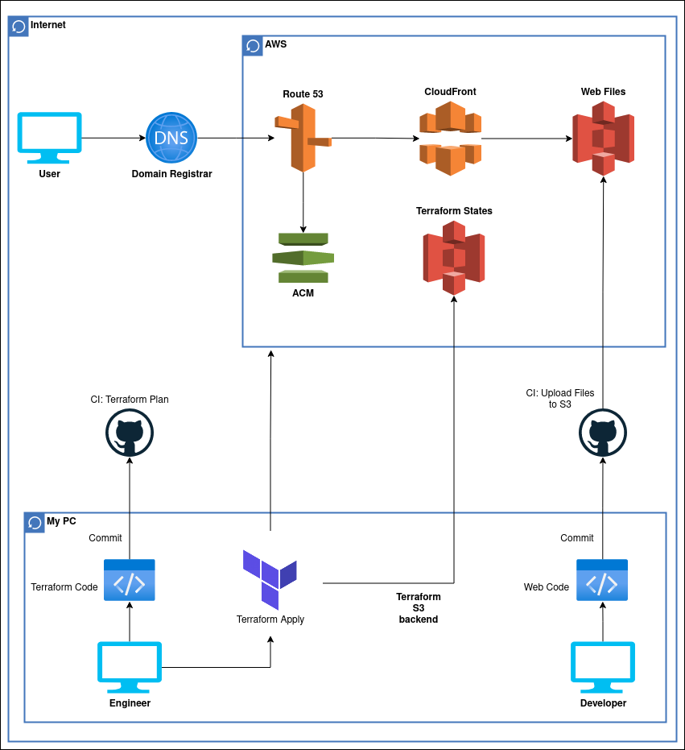

# web-portfolio-infra

Infra to deploy my web porfolio in different ways. The current in production is the Terraform way.

## Kubernetes
It deploys a simple pod running Nginx with a customized config file to enable gzip compression. It retrieves the image from a private repository inside Docker Hub.

## Terraform
It has three modules:
1. Backend: creates the needed S3 bucket to store the tfstate of everything else. Has Versioning and Lifecycle.
1. Base: creates the base Hosted Zone where delegate my domain to. We need it to be created earlier to have the domain proplery delegated before to set ACM and its validation.
1. Main: creates the web infra itself.

## Cloud Arquitecture
This architecture is not valid for kubernetes deployments

## Next Steps
* Improve CI/CD to approve plans and then apply them using the same CI/CD job.